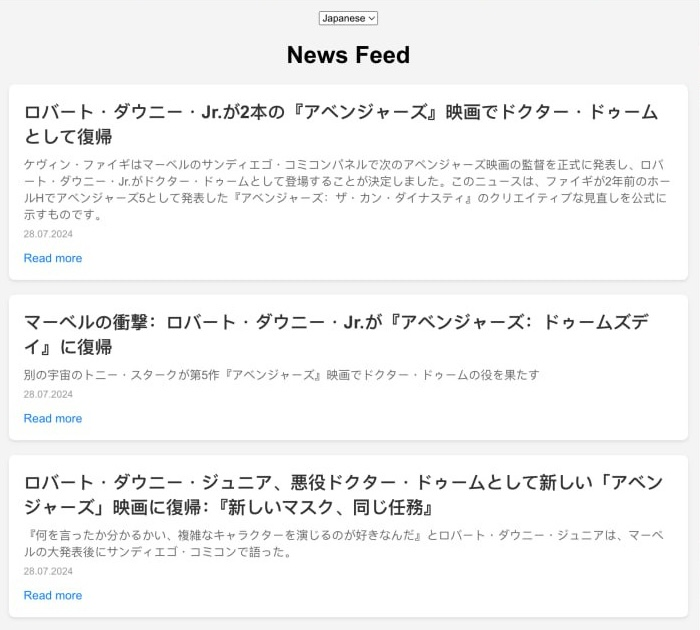

# flatview.news — Global News Without the Filter

**Role:** Fullstack Developer
**Date:** Mar 2026
**Stack:** React 18, Flask, MongoDB Atlas, GPT-4o-mini, LangChain, Auth0, Stripe
**Links:** [GitHub](https://github.com/vkram2711/flatview.news)

---



---

## Overview

A web app that uses LLMs to translate news from foreign sources that may be underreported by your national media. Read global news in Arabic, English, French, German, Japanese, Spanish, or Ukrainian — all translated on the fly by GPT-4o-mini.

The core idea: most people only read news in one or two languages, from outlets in their own country. Flatview surfaces what foreign media is covering and makes it readable in your language, giving you a wider picture of what's actually happening in the world.

---

## How It Works

1. **News ingestion** — articles are fetched from GNews and full content is extracted via WorldNewsAPI
2. **Language detection** — each article's language is detected automatically
3. **Translation** — articles are translated into all 7 supported languages using GPT-4o-mini via LangChain, processed in async batches
4. **Serving** — a Flask API serves articles with their translations from MongoDB; the React frontend lets users pick a language and browse the feed

---

## Tech Stack

| Layer | Technology |
|---|---|
| Frontend | React 18, Auth0, Stripe, React Router |
| Backend | Python / Flask |
| Database | MongoDB Atlas (MongoEngine) |
| AI | OpenAI GPT-4o-mini, LangChain |
| News sources | GNews API, WorldNewsAPI |
| Auth | Auth0 |
| Payments | Stripe |
| Feedback | Notion API |
| Deployment | Docker Compose |

---

## Supported Languages

Arabic · English · French · German · Japanese · Spanish · Ukrainian

---

## API

**`GET /top_news`** — returns a translated article feed

| Param | Default | Description |
|---|---|---|
| `language` | `en` | One of: `ar`, `en`, `fr`, `de`, `ja`, `es`, `uk` |

**`GET /article/<id>`** — returns full article content translated into the requested language

**`POST /feedback`** — submits user feedback to a Notion database

```json
{ "feedback": "Great app!", "rating": 5, "contact": "user@example.com" }
```

---

## Project Structure

```
flatview.news/
├── backend/
│   ├── app.py                   # Flask app and API routes
│   ├── load_news.py             # Fetch + translate news pipeline
│   ├── mongo/
│   │   └── models.py            # MongoEngine document models
│   └── utils/
│       ├── news_utils.py        # News fetching and storage
│       └── translation_utils.py # LangChain translation pipeline
└── frontend/
    └── src/
        ├── NewsFeed.js          # Article list view
        ├── Article.js           # Single article view
        └── ArticlesContext.js   # Global state (articles, language)
```

---

## Run with Docker

```bash
cp backend/.env.example backend/.env
cp frontend/.env.example frontend/.env
docker compose up --build
# Frontend: http://localhost:80
# Backend API: http://localhost:5000
```
