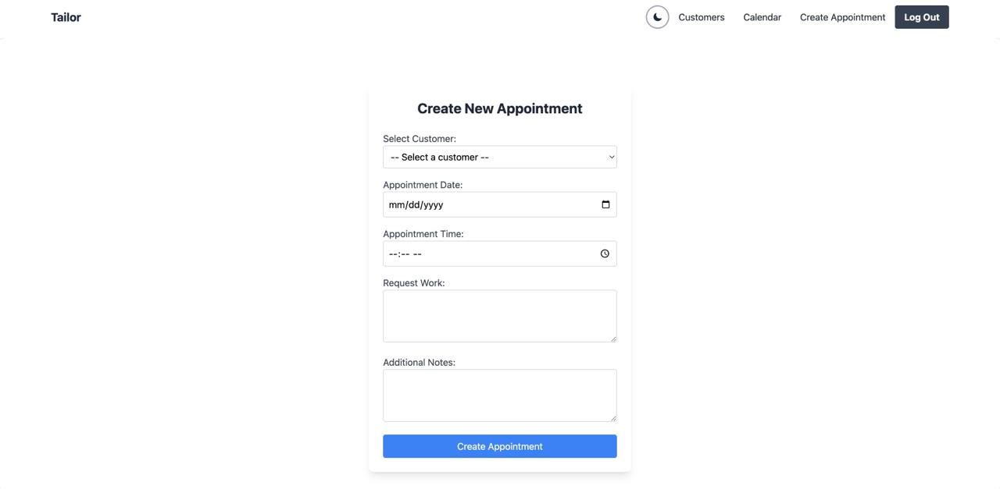

# Tailor — Client & Appointment Management for Tailors

**Role:** Fullstack Developer
**Date:** Mar 2025
**Stack:** React 18, FastAPI, MongoDB Atlas, Auth0, Tailwind CSS

---

## Overview

A SaaS platform built for independent tailors to manage their client relationships, appointments, and measurements in one place. Designed based on interviews with tailors across Bangkok and Buenos Aires, spanning budget through high-end segments.

[**View Figma Prototype →**](https://www.figma.com/proto/9GJxFexcyyaDr6J3R84c0J/Tailor-web?page-id=0%3A1&node-id=1-2&scaling=scale-down&starting-point-node-id=1%3A2) · [**GitHub →**](https://github.com/vkram2711/tailor-saas)


---

## Features

- **Client management** — store profiles, contact details, and notes per client
- **Measurements** — record and track body measurements per client over time
- **Appointment booking** — tailors create appointments; clients can self-book via a shareable link
- **Calendar view** — monthly/weekly calendar showing all upcoming appointments at a glance
- **Appointment workflow** — confirm, reschedule, or cancel with automatic email notifications sent to clients
- **Tailor profile** — set name, address, and phone number shown to clients in outgoing emails
- **Multi-language** — English and Spanish (i18n-ready architecture)
- **Auth0 authentication** — secure login for tailors via OAuth 2.0 / JWT

---

## Tech Stack

| Layer | Technology |
|---|---|
| Frontend | React 18, Tailwind CSS, react-big-calendar |
| Backend | Python 3.10, FastAPI, uvicorn |
| Database | MongoDB Atlas (async via Motor) |
| Auth | Auth0 (OAuth 2.0 / JWT) |
| Email | Gmail SMTP via fastapi-mail |
| Deployment | Heroku (frontend + backend) |

---

## Architecture

```
fullstack-tailor/
├── backend/
│   ├── main.py          # FastAPI app and all API routes
│   ├── models.py        # Pydantic data models
│   ├── auth0_utils.py   # Auth0 JWT verification
│   ├── mail_utils.py    # Email notification helpers
│   └── mongo_utils.py   # MongoDB connection
└── frontend/
    └── src/
        ├── pages/       # Route-level page components
        ├── components/  # Shared UI components
        └── static/      # i18n translation files (en, es)
```

---

## API

**Public endpoints** (no auth — for client self-booking flow)

| Method | Path | Description |
|---|---|---|
| GET | `/api/tailors/{id}/customers/check` | Check if a customer exists by email |
| POST | `/api/public/customers` | Register a new customer |
| POST | `/api/tailors/{id}/appointments` | Customer self-books an appointment |

**Protected endpoints** (JWT required)

| Method | Path | Description |
|---|---|---|
| GET/POST | `/api/customers` | List or create customers |
| GET/PUT/DELETE | `/api/customers/{id}` | Manage a customer |
| GET/POST | `/api/customers/{id}/measurements` | Record measurements |
| GET/POST | `/api/appointments` | List or create appointments |
| PUT | `/api/appointments/{id}/reschedule` | Reschedule |
| PUT | `/api/appointments/{id}/confirm` | Confirm |
| DELETE | `/api/appointments/{id}` | Cancel |
| GET/POST | `/api/tailor/profile` | Tailor profile |

---

## Design Process

The feature set was derived from interviews with working tailors across two cities in very different markets — Bangkok (high volume, competitive pricing) and Buenos Aires (artisan, relationship-driven). The Figma prototype was built to validate the booking flow and measurement tracking UX before writing any backend code.

[**Open Figma prototype →**](https://www.figma.com/proto/9GJxFexcyyaDr6J3R84c0J/Tailor-web?page-id=0%3A1&node-id=1-2&scaling=scale-down&starting-point-node-id=1%3A2)
